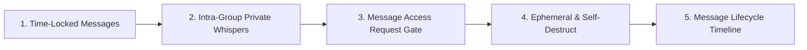

# 🧪 MessageLab — Independent Messaging Product Experimentation Workbench

[](https://react.dev/)
[](https://www.typescriptlang.org/)
[](https://vitejs.dev/)
[](https://tailwindcss.com/)
[](VISION.md)
[](#-core-innovation-1-interactive-dual-sided-workbench)
[](LICENSE)

> **Build → Improve → Share**  
> *An independent product experimentation workbench exploring next-generation messaging interactions, conditional access mechanisms, and dual-perspective prototyping.*

---

## 🎯 The Mission & Vision

Modern messaging applications have largely remained unchanged for years: write text, press send, and the recipient sees it immediately. While this works well for synchronous communication, it introduces subtle frictions in real-world human dynamics—accidental spoilers, timing disconnects, awkward group-chat noise, and lack of temporal control over personal notes.

**MessageLab** is an independent messaging product experiment. We do not rebuild existing commercial apps for the sake of cloning; rather, we use familiar messaging UI patterns as a testing ground to invent, prototype, stress-test, and share novel interaction concepts.

### The Core Formula:
```
Existing Product ➔ Identify Problem / Opportunity ➔ Design New Feature ➔ Build Working Prototype ➔ Test in Dual-UI ➔ Share Idea
```

> *"MessageLab হলো একটি independent messaging product experiment, যেখানে existing messaging apps-এর সাধারণ experience দেখে ছোট ছোট নতুন feature concept তৈরি, prototype এবং test করা হবে। প্রথমে এটি একটি দুই-পাশের messaging interface হবে, যেখানে **Sender এবং Receiver একই conversation-এর দুইটি আলাদা view** দেখতে পারবে। এরপর একে একে নতুন messaging feature যোগ করা হবে এবং দেখা হবে বাস্তবে featureটি কীভাবে কাজ করতে পারে। এটি কোনো existing company বা Messenger-এর clone নয়। বরং messaging experience কীভাবে আরও useful বা interesting করা যায়, সেই ধরনের **product experimentation project**।"*

---

## 🔬 Core Innovation 1: Interactive Dual-Sided Workbench

In real-world messaging development, testing both sides of a conversation traditionally requires multiple physical devices or separate browser sessions. MessageLab solves this by building an interactive, synchronized **Two-Sided Split Workbench**:

```
┌─────────────────────────────────────────┬─────────────────────────────────────────┐
│       🟢 SENDER PERSPECTIVE (YOU)       │    🔵 RECEIVER PERSPECTIVE (RECIPIENT)   │
├─────────────────────────────────────────┼─────────────────────────────────────────┤
│ • Full interactive composer             │ • Live mirrored conversation stream     │
│ • Dynamic completion smart avatars      │ • Locked gift / padlock rendering       │
│ • "Send effects" drawer (Hearts/Lock/🔥)│ • Live countdown ticker (or hidden)     │
│ • Duration presets: 30s, 1h, 1d, custom │ • Auto-unlock reaction on timeout       │
│ • Recipient timer visibility toggle     │ • Simulated reply composer              │
└─────────────────────────────────────────┴─────────────────────────────────────────┘
```

- **Single-Click Switcher:** Toggle smoothly between **Single Focused View** (with instant `[👁️ Sender ⇄ Recipient]` perspective flipping) and **Dual Split-Screen Workbench** (side-by-side synchronized view).
- **Zero-Latency Reactive Sync:** Actions taken on the Sender side instantly reflect in the Receiver window through a unified reactive store.

---

## 🔒 Core Innovation 2: Time-Locked Messages (Active Prototype)

Our flagship Phase 3 feature experiment tackles the problem of **temporal anticipation and conditional release**:

### How It Works:
1. **Context-Aware Triggering:** When typing a message (e.g. `"I am good"`), the composer dynamically detects sentence completion and surfaces 3D avatar suggestions alongside the blue search icon.
2. **"Send Effects" Integration:** Clicking the drawer opens the native effects tray:
   - 💖 **Hearts** (`"${text}"`)
   - 🎁 **Gift Box** (interactive tap-to-unwrap)
   - 🔒 **Time-Lock** (scheduled countdown unlock)
   - 🔥 **Fire** & 🎉 **Confetti**
3. **Configurable Lock Duration:**
   - Instant testing presets: `30s` (quick test), `5m`, `1h`, `1d`, `3d`, `7d`, `30d`.
   - Precision calendar picker: Select any custom date and time in the future.
4. **Receiver Timer Visibility Toggle (`ON` / `OFF`):**
   - **🟢 ON:** The recipient sees an active live countdown ticking down backwards (`⏳ Unlocks in 00:29`).
   - **🙈 OFF:** The countdown is completely hidden. The recipient knows a locked message exists, but cannot see the timer or content until the moment of release.
5. **Auto-Unlocking Engine:** Driven by a continuous 1-second reactive clock, the moment the scheduled unlock timestamp is reached, the locked card transitions smoothly into the revealed message.
6. **Sender Controls & Overrides:** Senders retain authority over their locked messages, with in-chat options to toggle receiver timer visibility anytime or trigger an instant demo unlock.

---

## 🔮 Strategic Product Roadmap



| Phase | Experimental Module | Core Concept & User Problem Solved | Status |
| :--- | :--- | :--- | :--- |
| **Pillar 1** | **Time-Locked Messages** | Schedule messages today for future release with receiver countdown toggle and auto-unlocking. | ✅ Active Prototype |
| **Pillar 2** | **Intra-Group Private Whispers** | Send a private message inside a group chat intended for only 1 member. Others see a blurred placeholder, eliminating splinter chats. | 🔬 Next Prototype |
| **Pillar 3** | **Message Access Request Gate** | Lock a message behind an access gate requiring the recipient to request permission and the sender to grant it before viewing. | 📋 In Design |
| **Pillar 4** | **Ephemeral & Self-Destruct Lifecycle** | Configurable post-read countdowns that destroy message content upon viewing. | 📋 In Design |
| **Pillar 5** | **Message Lifecycle Status Timeline** | Comprehensive audit log tracking: `Drafted ➔ Sent ➔ Delivered ➔ Locked ➔ Timer Started ➔ Requested ➔ Unlocked ➔ Read ➔ Expired`. | 🔭 Strategic Vision |

---

## 🛠️ Architecture & Tech Stack

```
                              ┌──────────────────────────────────────────────┐
                              │             MessageLab Dashboard             │
                              │  • React 18 + TypeScript + Vite 5            │
                              │  • Tailwind CSS Dark Architecture            │
                              │  • Dual-Perspective Split Synchronizer       │
                              └──────────────────────┬───────────────────────┘
                                                     │
                       ┌─────────────────────────────┴─────────────────────────────┐
                       │                                                           │
            ┌──────────▼──────────┐                                     ┌──────────▼──────────┐
            │   useMessenger Hook │                                     │ Smart Effects &     │
            │  • Reactive Store   │                                     │ Completion Engine   │
            │  • 1-Sec Tick Engine│                                     │  • Linguistic Rules │
            │  • Lock Evaluator   │                                     │  • 3D Avatar Matrix │
            └──────────┬──────────┘                                     └─────────────────────┘
                       │
        ┌──────────────┴──────────────┐
        │                             │
┌───────▼───────┐             ┌───────▼───────┐
│  Sender View  │             │ Receiver View │
│ • Composer    │ ◄- Sync -►  │ • Lock Card   │
│ • Effect Tray │             │ • Countdown   │
└───────────────┘             └───────────────┘
```

- **Core Engine:** React 18, TypeScript (Strict Mode), Vite 5
- **Styling & UI:** Tailwind CSS v3, custom gradients, responsive mobile/desktop layouts
- **Time Sync:** Precision `setInterval` 1000ms heartbeat with ISO-8601 UTC timestamp reconciliation
- **State Storage:** Reactive local persistence engine with automated schema hydration

---

## ⚡ Quickstart & Installation

### 1. Clone the Repository
```bash
git clone https://github.com/mdprince007/MessageLab.git
cd MessageLab
```

### 2. Install Dependencies
```bash
npm install
```

### 3. Launch Development Server
```bash
npm run dev
```

Open your browser and navigate to:
```
http://localhost:5173
```

- **Interactive Split-Screen:** Toggle `⚡ Dual Split-Screen` at the top bar to view Sender & Receiver simultaneously.
- **Run Static Analysis & Production Build:**
```bash
npm run lint
npm run build
```

---

## 📂 Repository Structure

```
MessageLab/
├── src/
│   ├── components/
│   │   ├── ChatWindow.tsx            # Primary chat frame supporting dual perspective
│   │   ├── ChatHeader.tsx            # Header with call actions, info, and demo overrides
│   │   ├── MessageArea.tsx           # Virtualized message list with unwrap animations
│   │   ├── MessageBubble.tsx         # Renders text, 3D avatars, gift boxes, and lock cards
│   │   ├── MessageComposer.tsx       # Smart input bar with "Send effects" & lock popup
│   │   ├── ChatsSidebar.tsx          # Conversation threads and search
│   │   ├── ConversationItem.tsx      # Thread item with online state and badge counters
│   │   ├── NavigationRail.tsx        # MessageLab branding rail & tab navigator
│   │   ├── LockedDetailModal.tsx     # Inspection modal for locked message state
│   │   ├── ThemeModal.tsx            # Color gradient theme selector
│   │   ├── CallModal.tsx             # Simulated voice & video calling overlay
│   │   └── StoryTray.tsx             # Ephemeral story tray
│   ├── hooks/
│   │   ├── useMessenger.ts           # Central store, 1s tick engine, and lock manager
│   │   └── useMessages.ts            # Message lifecycle utilities
│   ├── types/
│   │   ├── messenger.ts              # Core types: Message, LockConfig, Effects, Conversation
│   │   └── message.ts                # Experimental message models
│   ├── utils/
│   │   └── smartStickers.ts          # Sentence completion evaluator & effects list
│   ├── data/
│   │   └── mockData.ts               # Seed data for simulated contacts
│   ├── App.tsx                       # Workbench shell (Single vs Dual Split-Screen switcher)
│   ├── main.tsx                      # Entrypoint
│   └── index.css                     # Global styles
├── VISION.md                         # Detailed Bengali & English strategic vision manifesto
├── README.md                         # Project documentation and architecture guide
├── LICENSE                           # MIT License
├── package.json                      # Dependencies and scripts
├── tailwind.config.js                # Tailwind configuration
└── tsconfig.json                     # TypeScript configuration
```

---

## ⚖️ Independent Project Disclaimer

*MessageLab is an independent experimental software development project conducted for user-experience research and novel messaging interaction design. It is not an official clone, and is not affiliated with, endorsed by, or associated with Meta Platforms, Inc., Messenger, WhatsApp, or any existing commercial entity. All concepts, interfaces, and prototypes are developed strictly for product experimentation and technical research.*

---

## 🤝 Contributing & License

Contributions, feedback, and collaboration on next-generation messaging ideas are warmly welcomed!

This project is licensed under the [MIT License](LICENSE).