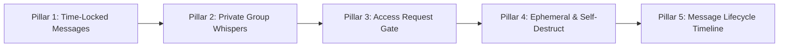

# 🧪 MessageLab — Product Vision & Experimentation Manifesto

> **Tagline:** Build → Improve → Share  
> **Type:** Independent Messaging Product Experiment  
> **Status:** Phase 3 Active Prototype (Time-Locked Messages)  
> **Author & Lead:** mdprince

---

## ১. প্রকল্পের মূল উদ্দেশ্য ও দর্শন (The Mission & Core Philosophy)

আজকের বিশ্বে মেসেজিং অ্যাপ্লিকেশন (যেমন: Messenger, WhatsApp, Telegram, Signal) আমাদের প্রাত্যহিক যোগাযোগের মূল মাধ্যম। কোটি কোটি মানুষ প্রতিদিন এই প্ল্যাটফর্মগুলো ব্যবহার করছে। কিন্তু আধুনিক মেসেজিং অ্যাপগুলোর বেসিক স্ট্রাকচার বহু বছর ধরে প্রায় একই রকম রয়েছে—টেক্সট লেখো, সেন্ড করো, রিসিভার সাথে সাথে দেখবে।

**MessageLab** কোনো বিদ্যমান মেসেজিং কোম্পানির ক্লোন নয়, বরং এটি একটি **Independent Messaging Product Experimentation Workbench**। 

আমাদের লক্ষ্য হলো:
1. বর্তমান মেসেজিং অভিজ্ঞতার ছোট ছোট ফাঁক ও অপ্রকাশিত সুযোগ (unmet needs / subtle frictions) চিহ্নিত করা।
2. দ্রুত কার্যকরী সমাধান ও নতুন ফিচার কনসেপ্ট ডিজাইন করা।
3. একটি পূর্ণাঙ্গ, রিয়েল-টাইম **Interactive Two-Sided Workbench (Sender ⇄ Receiver)** তৈরি করে ফিচারটির বাস্তব কার্যকারিতা প্রমাণ করা।
4. আইডিয়া ও ফাইন্ডিংস সবার সাথে শেয়ার করা।

```
                                 THE MESSAGELAB FORMULA
┌──────────────────┐     ┌──────────────────────┐     ┌────────────────────┐
│ Existing Product │ ──> │ Identify Opportunity │ ──> │ Design New Feature │
└──────────────────┘     └──────────────────────┘     └────────────────────┘
                                                                │
                                                                ▼
┌──────────────────┐     ┌──────────────────────┐     ┌────────────────────┐
│  Share the Idea  │ <── │   Test in Dual-UI    │ <── │ Build Working Demo │
└──────────────────┘     └──────────────────────┘     └────────────────────┘
```

> *"MessageLab হলো একটি independent messaging product experiment, যেখানে existing messaging apps-এর সাধারণ experience দেখে ছোট ছোট নতুন feature concept তৈরি, prototype এবং test করা হবে। এটি কোনো existing company বা Messenger-এর clone নয়। বরং messaging experience কীভাবে আরও useful বা interesting করা যায়, সেই ধরনের product experimentation project।"*

---

## ২. দ্বৈত-দৃষ্টিভঙ্গি ওয়ার্কবেঞ্চ (Interactive Dual-Perspective Architecture)

মেসেজিং ফিচারের সবচেয়ে বড় চ্যালেঞ্জ হলো: **সেন্ডারের অভিজ্ঞতা এবং রিসিভারের অভিজ্ঞতা সম্পূর্ণ বিপরীত হতে পারে।**

একটি সাধারণ মেসেঞ্জারে টেস্ট করতে গেলে দুইটি আলাদা ফোন বা দুইটি আলাদা ব্রাউজার অ্যাকাউন্ট প্রয়োজন হয়। MessageLab এই সমস্যার সমাধান করেছে এর **Built-in Two-Sided Workbench** দিয়ে:
- **Left Panel (Sender Perspective):** সেন্ডারের ফুল কন্ট্রোল—মেসেজ টাইপ করা, স্মার্ট স্টিকার সাজেশন পাওয়া, সেন্ট ইফেক্টস নির্বাচন করা এবং মেসেজ লক করার যাবতীয় প্যারামিটার সেট করা।
- **Right Panel (Receiver Perspective):** রিসিভারের লাইভ অভিজ্ঞতা—রিসিভার ঠিক কী দেখবে? মেসেজের টেক্সট কি লুকিয়ে আছে? টাইমার কি দেখা যাচ্ছে নাকি বন্ধ আছে? আনলক হওয়ার মুহূর্তটিতে কেমন অ্যানিমেশন হবে?
- **Real-Time Synchronous State Engine:** দুইটি প্যানেল একই মেসেজ স্টেট মেশিনের সাথে সিঙ্ক করা। একপাশে কোনো অ্যাকশন ঘটালে অন্যপাশে মিলি-সেকেন্ডে তার প্রভাব দৃশ্যমান হয়।

---

## ৩. সক্রিয় ফিচার প্রোটোটাইপ (Active Prototype: Phase 3)

### 🔒 Time-Locked Messages (সময়-নিয়ন্ত্রিত লক মেসেজ)

#### সমস্যা চিহ্নিতকরণ (The Opportunity):
- জন্মদিনের শুভেচ্ছা বা বার্ষিকীর উইশ আমরা হয়তো আগের রাতে বা অবসর সময়ে মনে করে টাইপ করতে চাই, কিন্তু রাত ১২:০০টার আগে প্রাপক যেন দেখতে না পায়।
- কুইজ বা ধাঁধার উত্তর দেওয়ার ক্ষেত্রে আগে থেকে উত্তর পাঠিয়ে রাখা কিন্তু নির্দিষ্ট সময়ের পূর্বে লুকানো থাকা।
- সারপ্রাইজ মেসেজ বা ভবিষ্যৎ মুহূর্তের জন্য টাইম ক্যাপসুল তৈরি করা।

#### সমাধান ও বাস্তবায়ন:
- সেন্ডার ড্রয়ারের **"Send effects"** রো থেকে সরাসরি **🔒 Time-Lock** সিলেক্ট করতে পারেন।
- **লক ডিউরেশন প্রেসেট ও কাস্টম টাইম:** `30s` (টেস্টিং), `5m`, `1h`, `1d`, `3d`, `7d`, `30d` অথবা কাস্টম ক্যালেন্ডার ডেট/টাইম।
- **রিসিভার টাইমার ভিজিবিলিটি কন্ট্রোল (ON / OFF):**
  - **ON:** রিসিভারের স্ক্রিনে লাইভ কাউন্টডাউন টাইমার উল্টো ঘুরবে (`⏳ Unlocks in 00:29`)।
  - **OFF:** রিসিভার মেসেজটি লকড অবস্থায় দেখবে, কিন্তু কোনো টাইমার দেখতে পারবে না। এতে সারপ্রাইজ বা কিউরিওসিটি বজায় থাকে।
- **স্বয়ংক্রিয় আনলক ইঞ্জিন (1-Second Reactive Clock):** নির্ধারিত সময় শেষ হওয়ামাত্র ব্যাকগ্রাউন্ড টাইমার কোনো রিফ্রেশ ছাড়াই লাইভ চ্যাটে মেসেজের গোপন টেক্সট উন্মোচন করে।
- **সেন্ডারের অন-ডিমান্ড ওভাররাইড:** সেন্ডার চাইলে চ্যাট চলাকালীন যেকোনো সময় টাইমার ভিজিবিলিটি পরিবর্তন বা ডেমো পারপাসে তাৎক্ষণিক আনলক করতে পারেন।

---

## ৪. ভবিষ্যৎ এক্সপেরিমেন্টাল রোডম্যাপ (Future Experimental Roadmap)



| Phase | Experimental Module | Core Concept & User Problem | Status |
| :--- | :--- | :--- | :--- |
| **Pillar 1** | **Time-Locked Messages** | সেন্ডার মেসেজ পাঠাবে এখনই, কিন্তু প্রাপক ভবিষ্যৎ নির্ধারিত সময়ের পূর্বে খুলতে পারবে না। কাউন্টডাউন ভিজিবিলিটি কন্ট্রোল ও অটো-আনলক। | ✅ Active Prototype |
| **Pillar 2** | **Intra-Group Private Whispers** | একটি গ্রুপ চ্যাটের ভেতরে মেসেজ পাঠানো হবে, কিন্তু গ্রুপের বাকি সবার কাছে তা ব্লার বা লকড থাকবে—কেবলমাত্র নির্দিষ্ট একজন বা দুজন নির্ধারিত মেম্বার মেসেজটি ডিক্রিপ্ট করতে পারবে। গ্রুপ ভেঙে আলাদা ইনবক্সে যাওয়ার ঝামেলা দূর করবে। | 🔬 Next Prototype |
| **Pillar 3** | **Message Access Request Gate** | মেসেজটি পাঠানোর পর প্রাপকের কাছে একটি "Request Unlock" বাটন থাকবে। প্রাপক রিকোয়েস্ট পাঠালে সেন্ডার নোটিফিকেশন থেকে 'Approve' করলে তবেই মেসেজটি উন্মুক্ত হবে। | 📋 In Design |
| **Pillar 4** | **Ephemeral & Self-Destruct Lifecycle** | পড়ার পর নির্দিষ্ট সেকেন্ড পর মেসেজ মিলিয়ে যাবে। স্ক্রিনশট বা রি-রিডিং প্রিভেনশন। | 📋 In Design |
| **Pillar 5** | **Message Status Lifecycle Timeline** | মেসেজের সম্পূর্ণ অডিট ট্রেইল: `Drafted ➔ Sent ➔ Delivered ➔ Locked ➔ Timer Started ➔ Access Requested ➔ Unlocked ➔ Read ➔ Expired` একটি ইন্টারেক্টিভ টাইমলাইনে দেখতে পাওয়া। | 🔭 Strategic Vision |

---

## ৫. আর্কিটেকচার ও টেকনিক্যাল ডিজাইন (Technical Architecture)

MessageLab-এর আর্কিটেকচার অত্যন্ত মডুলার এবং এক্সটেনসিবল:
1. **Presentation Layer:** React 18 + Tailwind CSS + Lucide Icons সমৃদ্ধ মেটাকুল ডার্ক মোড ইন্টারফেস।
2. **State & Reactive Sync Engine:** `useMessenger` হুকের মাধ্যমে লোকাল মেসেজ স্টোর, রিয়েল-টাইম ১-সেকেন্ড ক্লক সিঙ্ক্রোনাইজেশন এবং পার্সপেক্টিভ সুইচিং পরিচালিত হয়।
3. **Smart Effects & Completion Evaluator:** `evaluateTextCompletion` ব্যবহার করে ব্যবহারকারীর টাইপ করা বাক্যের সম্পূর্ণতা যাচাই করে স্বয়ংক্রিয়ভাবে সার্চ আইকন থেকে থ্রিডি অ্যাভাটার স্টিকারে ট্রানজিশন হয়।
4. **Time-Lock Scheduler:** প্রতিটি লকড মেসেজে `unlockAt` (ISO Timestamp) এবং `showTimerToReceiver` বুলিয়ান ফ্ল্যাগ সংরক্ষিত থাকে, যা গ্লোবাল টিকের সাথে রিঅ্যাক্টিভলি মূল্যায়ন করা হয়।

---

## ৬. নন-অ্যাফিলিয়েশন ডিসক্লেইমার (Independent Project Disclaimer)

*MessageLab is an independent experimental software development project conducted for user-experience research and novel messaging interaction design. It is not affiliated with, endorsed by, or associated with Meta Platforms, Inc., Messenger, or any existing commercial entity. All concepts, interfaces, and prototypes are developed strictly for product experimentation and technical research.*
